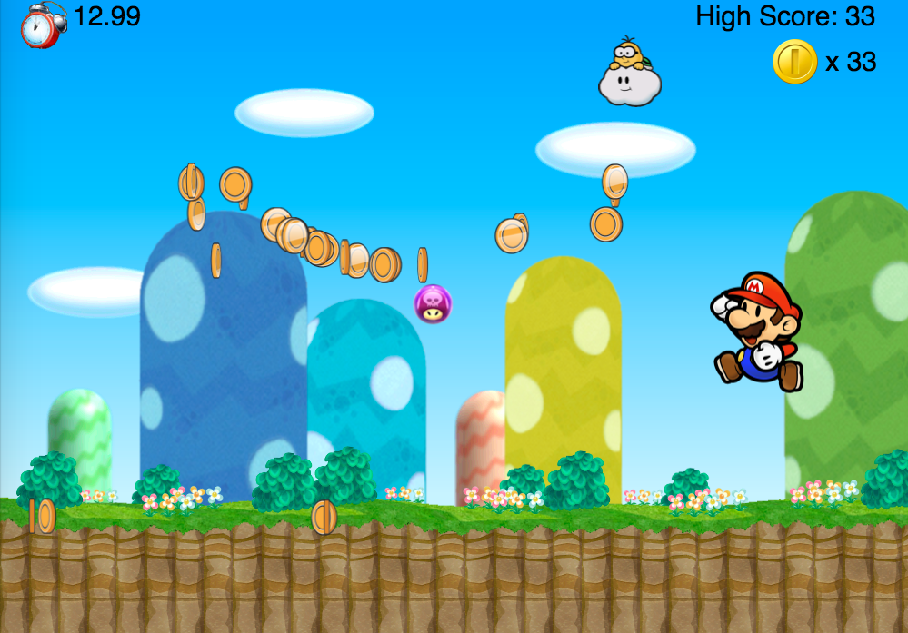
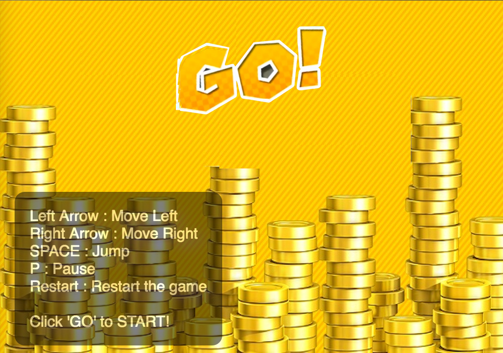
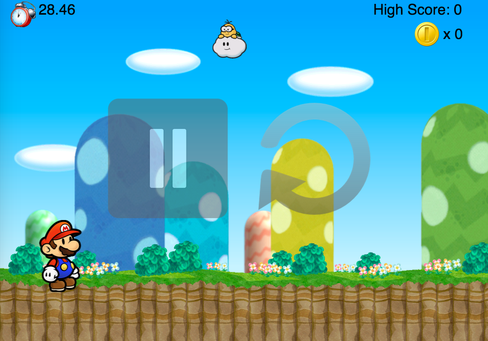

# Coin Rush

[Live site][coin-rush]
[coin-rush]: https://swissashley.github.io/js-CoinRush/

## Background

Paper Mario is back! Mario has 30 seconds to collect as many coins as possible.
Lakitu would throw out hundreds of coins during the 30 second period, as well as some poison mushrooms!
The general rule is to collect coins and avoid poison mushrooms, which would paralyze you for 2 seconds.
Every 100 coins would give you extra 5 seconds!
The game will end when times up.

## Functionality & MVP  

Users will be able to:

- [ ] Start, pause, and restart the game.
- [ ] Mario would move right, left, or jump.
- [ ] Collect coins.
- [ ] Avoid the poison mushrooms.

### Start Screen



### Pause/Restart Screen



## Architecture and Technologies

This project will be implemented with the following technologies:

- Vanilla JavaScript and `jquery` for overall structure and game logic,
- `HTML5 Canvas` for DOM manipulation and rendering.

In addition to the webpack entry file, there will be three scripts involved in this project:

`coin_rush.js`: this script will handle the logic for creating and updating the necessary background elements and rendering them to the DOM.

`moving_object.js`: this script will handle the logic of the behavior of any moving objects on the screen.

`mario.js`: this script will handle the logic of the behavior of Mario. i.e., move left, move right, jump, get a coin, eat a mushroom ...etc.

`lakitu.js`: this script will handle the logic of the behavior of Lakitu.

`coin.js`: extends moving_object.js.

`poison_mushroom.js`: extends moving_object.js.

### Entry point snippets

```js
  const Game = require("./game");
  const GameView = require("./game_view");

  document.addEventListener("DOMContentLoaded", function(){
    const canvasEl = document.getElementsByTagName("canvas")[0];
    canvasEl.width = Game.DIM_X;
    canvasEl.height = Game.DIM_Y;
    const ctx = canvasEl.getContext("2d");
    const game = new Game();
    let gameView = new GameView(game, ctx);
    gameView.start();
  });
```
### MovingObject snippets

```js

  ...

  isCollidedWith(otherObject) {
    let newPos = [this.pos[0] + this.radius, this.pos[1] + this.radius];
    let otherPos = [otherObject.pos[0] + otherObject.radius, otherObject.pos[1] + otherObject.radius];
    const centerDist = Util.dist(newPos, otherPos);
    return centerDist < (this.radius + otherObject.radius);
  }

  move(timeDelta) {
    const velocityScale = timeDelta / NORMAL_FRAME_TIME_DELTA,
        offsetX = this.vel[0] * velocityScale,
        offsetY = this.vel[1] * velocityScale;

    this.pos = [this.pos[0] + offsetX, this.pos[1] + offsetY];
    if (this.game.isOutOfBounds(this.pos)) {
      if (this.isWrappable) {
        this.pos = this.game.wrap(this.pos);
      } else {
        this.vel[0] = -this.vel[0];
      }
    }
  }

  ...
  
```

## Implementation Timeline

**Day 1**: Setup all necessary Node modules, including getting webpack up and running.  Create `webpack.config.js` as well as `package.json`.  Write a basic entry file and the bare bones of all scripts outlined above. Do some researches how to create animation with sprites. Goals for the day:

- Get a green bundle with `webpack`
- Learn enough animation with sprites and render an object to the `Canvas` element

**Day 2**: Create `moving_object` object and its logic. Extend `poison_mushroom`, `coin`, and `lakitu` from `moving_object`. Goals for the day:

- Complete the `moving_object` and make sure the mushroom and coin would fall.
- Update game logic when the collision happens.
- Complete the `lakitu` and make sure it will move right and left in a random speed on the sky.

**Day 3**: Build out the `Mario` object and connect to the `Board` object. Goals for the day:

- Complete the `mario` module (constructor, update functions)
- Render a square grid to the `Canvas`.
- Make sure Mario can move left, right, and jump.

**Day 4**: Install the controls for the user to interact with the game.  Style the frontend, making it polished and professional.  Goals for the day:

- Create controls for game speed, stop, start, reset, and shape type
- Have a styled `Canvas`, nice looking controls and title
- Polish the game with better background images and CSS effects.


## Bonus features

 Some anticipated updates are:

- [ ] Different type of gifts such as a superstar for Mario immune from the poison mushrooms.
- [ ] A normal mushroom for Mario to grow up and collect more coins.
